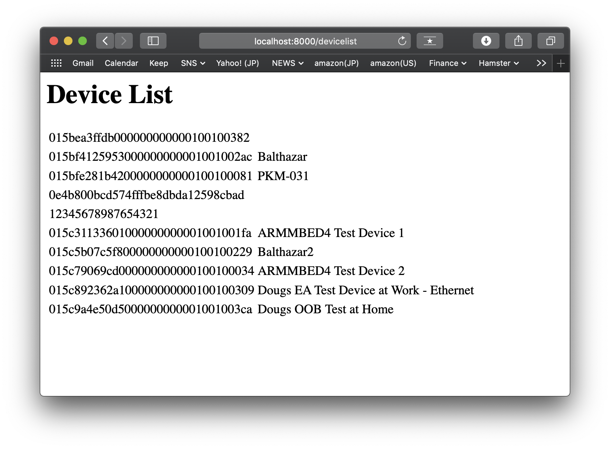

# An example of Pelion Device Management SDK for Java


# Prerequisites
* git
* Java Development Kit - [OpenJDK](https://jdk.java.net/12/) or other JDK
* Pelion Device Management Account - [Get a free account](https://os.mbed.com/pelion-free-tier/)
* Pelion Device Management API key - [Generating an API key](https://www.pelion.com/docs/device-management/current/integrate-web-app/api-keys.html#generating-an-api-key)

# Create working directory
Create a working directory and move there.
``` Bash
$ mkdir work
$ cd work
```

# Create jar file of Pelion Device Management SDK for Java
Create jar file, which is an archive file of Pelion Device Management SDK for Java library. You can use this jar file to import the SDK into your Java project.

## Clone the SDK repository
Clone the SDK repository from GitHub to get the SDK source codes.
``` Bash
$ git clone https://github.com/ARMmbed/mbed-cloud-sdk-java.git
```

## Build jar
Move to the SDK directory.
``` Bash
$ cd mbed-cloud-sdk-java
```
Build jar file using gradle.
``` Bash
$ ./gradlew shadowjar
```
After the command done, jar file is created at `build/libs/mbed-cloud-sdk-2.4.0-full.jar`. Note that SDK version number could be different.

# Create Sample App
Move to the working directory root.
``` Bash
$ cd ..
```
Create a sample project directory `app` and move there.
``` Bash
$ mkdir app
$ cd app
```

## Set API key
You need to set your API key in your project to communicate with Pelion Device Management Service. To do that, create `.env` file in your project.
``` Bash
$ echo "MBED_CLOUD_SDK_API_KEY=<your API key>" > .env
```
Replace `<your API key>` with your API key. For example,
``` Bash
# API key below is dummy.
$ echo "MBED_CLOUD_SDK_API_KEY=ak_1MDE1YTllNDRiZjA5MDI0MjBhMDE0MDBhMDAwMDAwMDA0168df54c11412dc3bb0a403000000003KQbrhr0fcC90J47uSpbk8nF7Y9bietx" > .env
```
## Create a sample code
Let's create a sample program to list first 10 devices from your account's device directory. This code was taken from the [official documentation](https://cloud.mbed.com/docs/latest/mbed-cloud-sdk-java/).

Put this file in the `app` directory.

``` Java
// File name: ListDevice.java
import java.io.IOException;

import com.arm.mbed.cloud.sdk.common.MbedCloudException;
import com.arm.mbed.cloud.sdk.devices.model.DeviceListDao;
import com.arm.mbed.cloud.sdk.devices.model.DeviceListOptions;

public class ListDevice {

    public static void main(String[] args) {

        try (DeviceListDao dao = new DeviceListDao()) {

            // Listing the first 10 devices on your Pelion Device Management account
            dao.list((new DeviceListOptions()).maxResults(10))
               .forEach(device -> System.out.println("Hello device " + device.getName()));

        } catch (MbedCloudException | IOException exception) {
            exception.printStackTrace();
        }
    }

}
```

## Compile
Compile the code. You need to specify the jar file created above. Note that the version number could be different.
``` Bash
$ javac -cp "../../mbed-cloud-sdk-java/build/libs/mbed-cloud-sdk-2.4.0-full.jar" ListDevice.java
```

## Run
Run the sample program.
``` Bash
$ java -cp "../../mbed-cloud-sdk-java/build/libs/mbed-cloud-sdk-2.4.0-full.jar:./" ListDevice
```
You'll get the device list from your device directory. Here's a sample output.
```
$ java -cp "../../mbed-cloud-sdk-java/build/libs/mbed-cloud-sdk-2.4.0-full.jar:./" ListDevice
SLF4J: Failed to load class "org.slf4j.impl.StaticLoggerBinder".
SLF4J: Defaulting to no-operation (NOP) logger implementation
SLF4J: See http://www.slf4j.org/codes.html#StaticLoggerBinder for further details.
Hello device
Hello device Balthazar
Hello device PKM-031
Hello device
Hello device
Hello device ARMMBED4 Test Device 1
Hello device Balthazar2
Hello device ARMMBED4 Test Device 2
Hello device Dougs EA Test Device at Work - Ethernet
Hello device Dougs OOB Test at Home
```

# Create Sample Webapp
Let's create a very simple sample webapp based on above program.

Move to the working directory root, create new directory `webapp`, and move there.
``` Bash
$ cd ..
$ mkdir webapp
$ cd webapp
```
Copy `.env` to `webapp` directory.
``` Bash
$ cp ../app/.env .
```

## Create sample webapp code
Put this file in `webapp` directory.
``` Java
// filename: MinimalHTTPServer.java
/* Referenced: 
 * http://www.java2s.com/Code/Java/Network-Protocol/MinimalHTTPServerbyusingcomsunnethttpserverHttpServer.htm
 */
import java.io.IOException;
import java.io.OutputStream;
import java.net.InetSocketAddress;

import com.arm.mbed.cloud.sdk.common.MbedCloudException;
import com.arm.mbed.cloud.sdk.devices.model.DeviceListDao;
import com.arm.mbed.cloud.sdk.devices.model.DeviceListOptions;
import com.sun.net.httpserver.HttpExchange;
import com.sun.net.httpserver.HttpHandler;
import com.sun.net.httpserver.HttpServer;

public class MinimalHTTPServer {
  public static void main(String[] args) throws IOException {
    HttpServer server = HttpServer.create(new InetSocketAddress(8000), 0);
    server.createContext("/devicelist", new Handler());
    server.start();
  }
}

class Handler implements HttpHandler {
  public void handle(HttpExchange xchg) throws IOException {
    StringBuffer response = new StringBuffer();

    response.append("<html>\n<body>\n<h1>Device List</h1>\n<table>");

    try (DeviceListDao dao = new DeviceListDao()) {

      // Listing the first 10 devices on your Pelion Device Management account
      dao.list((new DeviceListOptions()).maxResults(10))
        .forEach(device -> response.append("<tr><td>" + device.getEndpointName() 
          + "</td><td>" + device.getName() + "</td></tr>\n"));
    } catch (MbedCloudException | IOException exception) {
      exception.printStackTrace();
    }

    response.append("</table></body>\n</html>");

    xchg.sendResponseHeaders(200, response.length());
    OutputStream os = xchg.getResponseBody();
    os.write(response.toString().getBytes());
    os.close();
  }
}
```

## Compile
Compile the code. You need to specify the jar file created above. Note that the version number could be different.
``` Bash
javac -cp "../../mbed-cloud-sdk-java/build/libs/mbed-cloud-sdk-2.4.0-full.jar" MinimalHTTPServer.java
```

## Run
Run the sample program.
``` Bash
$ java -cp "../../mbed-cloud-sdk-java/build/libs/mbed-cloud-sdk-2.4.0-full.jar:./" MinimalHTTPServer
```
You may see nothing on the command line. Launch your browser and access [http://localhost:8000/devicelist](http://localhost:8000/devicelist). You'll see device list on your browser.



